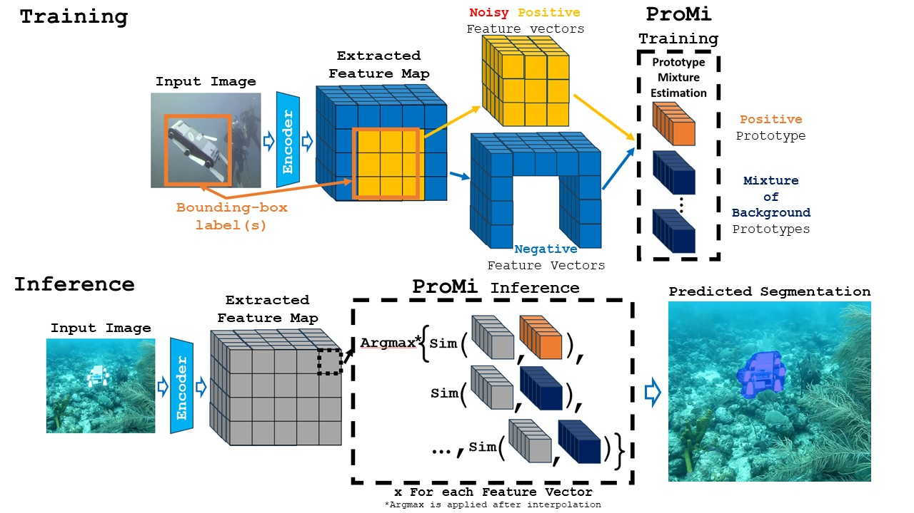

# ProMi: An Efficient Prototype-Mixture Baseline for Few-Shot Segmentation with Bounding-Box Annotations


## Updates

## Paper
### **ProMi: An Efficient Prototype-Mixture Baseline for Few-Shot Segmentation with Bounding-Box Annotations**

If you find this code useful for your research, please cite our paper (published at ICRA 2025):
```
@inproceedings{chiaroni2025promi,
  title={ProMi: An Efficient Prototype-Mixture Baseline for Few-Shot Segmentation with Bounding-Box Annotations},
  author={Chiaroni, Florent and Ayub, Ali and Ahmad, Ola},
  booktitle={IEEE International Conference on Robotics and Automation (ICRA)},
  year={2025}
}
```

### Abstract
<p align="justify">
  In robotics applications, few-shot segmentation is crucial because it allows robots to perform complex tasks with minimal training data, facilitating their adaptation to diverse, real-world environments. However, pixel-level annotations of even small amount of images is highly time-consuming and costly. In this paper, we present a novel few-shot binary segmentation method based on bounding-box annotations instead of pixel-level labels. We introduce, ProMi, an efficient prototype-mixture-based method that treats the background class as a mixture of distributions. Our approach is simple, training-free, and effective, accommodating coarse annotations with ease. Compared to existing baselines, ProMi achieves the best results across different datasets with significant gains, demonstrating its effectiveness. Furthermore, we present qualitative experiments tailored to real-world mobile robot tasks, demonstrating the applicability of our approach in such scenarios.
</p>

<p align="center">
  
</p>

## Get started

### Pre-requisites
Ensure you have the following dependencies installed:

* **Python** 3.9.17
* **pyyaml** 6.0.2
* **numpy** 1.26.4
* **scikit-learn** 1.5.0
* **opencv-python** 4.10.0.84
* **pillow** 11.1.0
* **torch** 2.7.0
* **torchvision** 0.22.0
* **xformers** 0.0.30
* **CUDA** 11.8 (for GPU support)

### Installation
To install all package dependencies, run:
```bash
cd <root_dir>
pip install -r requirements.txt
```

### Configuration
The script [`demo_script.py`](./scripts/demo_script.py) runs the proposed model ProMi on a sample from the [**SUIM**](https://irvlab.cs.umn.edu/resources/suim-dataset) dataset.
You can set paths and training parameters in the configuration file [`./configs/experiment_config.yaml`](./configs/experiment_config.yaml). Below are the key configurable parameters:
You can set the paths in the configuration file where you have:

**Training configuration**
```yaml
train_img_list_path: "../data/SUIM_robots_train/train.txt"
train_img_dir: "../data/SUIM_robots_train/images/train"
train_bbox_labels_dir: "../data/SUIM_robots_train/labels/train"
```
* Training labels correspond to bounding-box annotations per image in YOLOv8 PyTorch TXT format ([see details here](https://roboflow.com/formats/yolov8-pytorch-txt))

**Testing configuration**
```yaml
test_img_dir: "../data/SUIM_robots_test/images"
test_gt_seg_labels_dir: "../data/SUIM_robots_test/seg_labels"
```
* Test labels are pixel-wise binary segmentation masks stored in .bmp format.

**Pre-trained Feature Extractor**
```yaml 
checkpoint_path: "../../weights/dinov2_vitb14_pretrain.pth"
``` 
* DINOv2 VIT-B/14 backbone weights can be downloaded from: [dinov2_vitb14_pretrain.pth](https://dl.fbaipublicfiles.com/dinov2/dinov2_vitb14/dinov2_vitb14_pretrain.pth).

#### Running ProMi on a Data Sample
To apply ProMi on a data sample, run:
```bash
$ cd <root_dir>/scripts
$ python demo_script.py --shots <support_set_size>
```
where:
- ```<support_set_size>``` specifies the number of support set images.

## Recommendations
We recommend setting the number of background prototypes (```max_bg_proto_nbr```) to 2, as this setting consistently performed well across all tested datasets.

## Contributing
If you are interested in contributing to this project, start by reading our [Contributing guide](/CONTRIBUTING.md).

## License
This code is licensed under a custom **Non-Production License**, as specified in the [LICENSE](/LICENSE) file.
